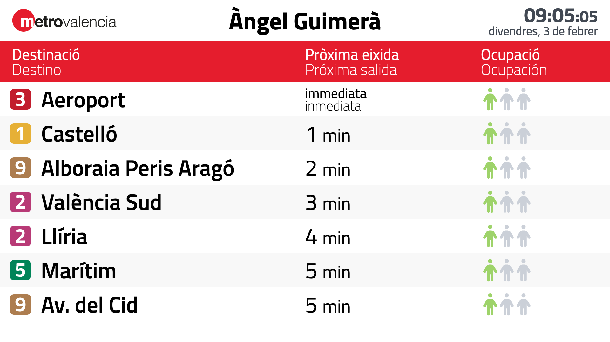
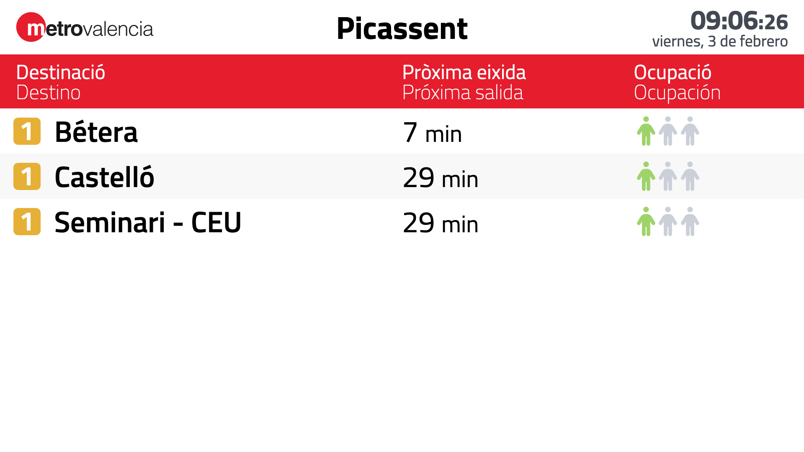

<p align="center"><a href="https://avptp.org"></a></p>

# Transit Info

<div align="center">
    
    
</div>

## About

Transit Info is an <ins>experimental</ins> web application made with [React](https://reactjs.org) that displays information related to one or more transport systems, such as schedules, issues and transfers. It is intended to be used in embedded systems, like informational screens at stops and stations.

During the early stages of development, only support for [Metrovalencia](https://www.metrovalencia.es) is included. The intention is to generalize the software to include more transport systems, even combining several of them simultaneously.

### Directory structure

The project follows the [default Create React App application structure](https://create-react-app.dev/docs/folder-structure/) with the following additions:

- `.github` holds the [GitHub Actions](https://github.com/features/actions) CI/CD pipelines.
- `deployments`, `.dockerignore`, `.env.example`, `docker-compose.yml` and `Dockerfile` contain the configuration and manifests that define the development and runtime environments with [Docker](https://www.docker.com) and [Docker Compose](https://docs.docker.com/compose).
- `docs` has documentation resources like specifications or screenshots.

### License

Copyright © 2020 Associació Valenciana pel Transport Públic

This software is distributed under the GNU General Public License. Please read [the software license](license.md) for more information on the availability and distribution.

## Getting started

This project comes with a containerized environment that has everything necessary to develop on any platform.

**TL;TR**

```Shell
make
```

### Requirements

Before starting using the project, make sure that the following software is installed on your machine:

- [Docker](https://docs.docker.com/engine/install), a virtualization software that allows to create lightweight virtual environments.
- [Docker Compose](https://docs.docker.com/compose/install/), a tool for defining and running multi-container Docker applications.

It is necessary to install the latest versions before continuing. You may follow the previous links to read the installation instructions.

### Initializing

First, initialize the project and run the environment.

```Shell
make
```

Then, install NPM dependencies by running `make` or directly in a shell within the container.

```Shell
make deps

# Or
make shell
npm ci
```

You can stop the environment by running the following command.

```Shell
make down
```

## Usage

You can run commands inside the virtual environment by running a shell in the container (`make shell`).

### Running the development server

Run the following command to start the development server:

```Shell
make run

# Or
make shell
npm run start
```

> Note that Git is not available in the container, so you should use it from the host machine. It is strongly recommended to use a desktop client like [Fork](https://git-fork.com) or [GitKraken](https://www.gitkraken.com).

## Deployment

The deployment process is automated with [GitHub Actions](https://github.com/features/actions). When changes are incorporated into production (`master` branch) or staging (`develop` branch), an automatic deployment is made to the corresponding environment.

## Troubleshooting

There are several common problems that can be easily solved. Here are their causes and solutions.

### Docker

The Docker environment should work properly. Otherwise, it is possible to rebuild it by running the following command.

```Shell
docker compose down
docker compose build --no-cache app
```

To start from scratch, you can remove all containers, images and volumes of your computer by running the following commands.

> Note that all system containers, images and volumes will be deleted, not only those related to this project.

```Shell
docker compose down
docker rm $(docker ps -a -q)
docker rmi $(docker images -q)
docker volume rm $(docker volume ls -f dangling=true -q)
```
